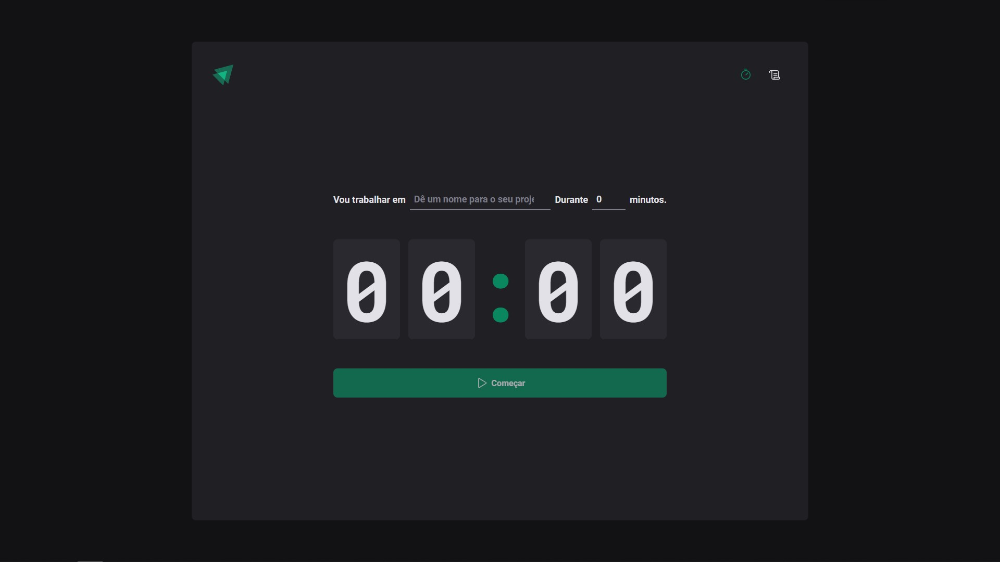
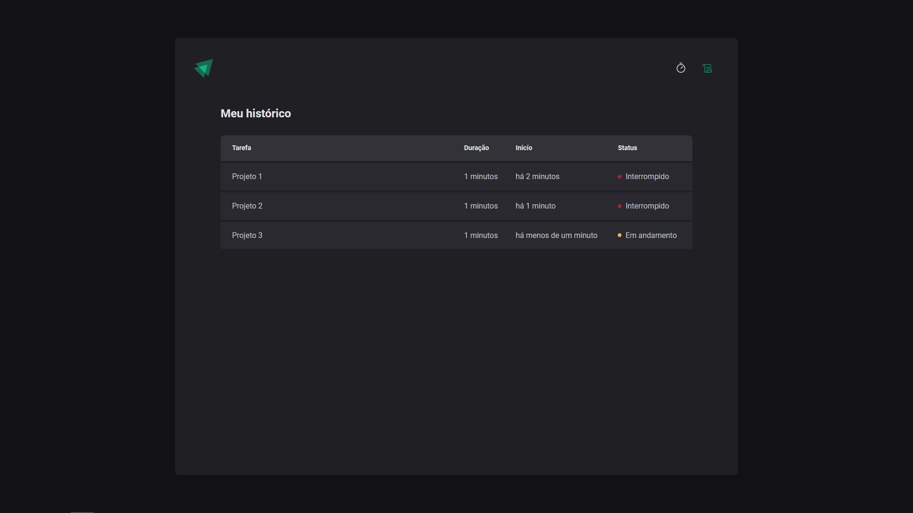

# Ignite Timer - Project Documentation

## About The Project

Ignite Timer is a productivity application designed to help users manage their time effectively while working on various tasks. The application allows users to set a task name and a timer for each task they intend to work on. With a sleek countdown feature on the main page and a comprehensive report page, users can track their activities, monitor progress, and view the status of each task—whether it's interrupted, in progress, or completed.


_Main Countdown Interface of Ignite Timer_


_Task Report Page Showing Task Status and Details_

## Features

- **Task Naming**: Assign names to different tasks for easy identification.
- **Custom Timer**: Set a specific duration for each task.
- **Countdown**: Visual countdown timer on the main page.
- **Task Reports**: Detailed reports of tasks, their creation times, and statuses.
- **Status Tracking**: Easily track whether tasks are interrupted, ongoing, or completed.

## Built With

Ignite Timer leverages modern web technologies for a responsive and intuitive user experience:

- [React](https://reactjs.org/) - A JavaScript library for building user interfaces.
- [TypeScript](https://www.typescriptlang.org/) - An open-source language which builds on JavaScript by adding static type definitions.

## Getting Started

To get a local copy up and running, follow these simple steps:

### Prerequisites

Ensure you have the `nodejs` installed on your local machine. If not, you can download it [here](https://nodejs.org/en/download/).

### Installation

1. Clone the repository:

```sh
git clone https://github.com/pdro-lucas/ignite-reactjs.git
```

2. Navigate to the project directory:

```sh
cd ignite-reactjs/02-ignite-timer
```

1. Install NPM packages:

```sh
# with npm
$ npm install

# you can use any package manager you like
```

## Usage

To start the application, run the following command in the project directory:

```sh
$ npm start
```

This runs the app in development mode. Open [http://localhost:5173](http://localhost:5173) to view it in the browser.

## Roadmap

Future updates and improvements planned for Ignite Timer:

- [ ] Adding support for Pomodoro and other time management techniques.
- [ ] Adding a settings page to allow users to customize the application.
- [ ] Imrpoving the UI/UX of the application.

## Contributing

Contributions are what make the open-source community such a fantastic place to learn, inspire, and create. Any contributions you make are **greatly appreciated**.

To contribute to Ignite Timer, please follow these steps:

1. Fork the Project
2. Create your Feature Branch (`git checkout -b feature/AmazingFeature`)
3. Commit your Changes (`git commit -m 'Add some AmazingFeature'`)
4. Push to the Branch (`git push origin feature/AmazingFeature`)
5. Open a Pull Request

## License

Distributed under the MIT License. See `LICENSE` for more information.

## Contact

Pedro Lucas - [@pdrolucasX](https://twitter.com/pdrolucasX) - pdrolucas.contato@gmail.com

Project Link: [https://github.com/pdro-lucas/ignite-reactjs](https://github.com/pdro-lucas/ignite-reactjs/tree/main/02-ignite-timer)
