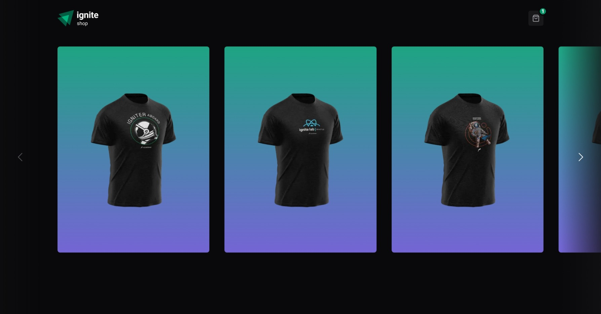

# Ignite Shop - E-Commerce Simulation with Stripe API Integration

## About The Project

Ignite Shop is a demonstration e-commerce application with the primary goal of integrating with the Stripe API. It's a storefront that specializes in showcasing a carousel of shirt products. Users can browse through the selection and, upon clicking a product, are taken to a detailed page where they can proceed to purchase via Stripe's checkout service. The application's checkout process is designed to simulate a real shopping experience, concluding with a success page that displays the details of the fictitious purchase.



_Preview of the main page._

## Features

- **Product Carousel**: Users can swipe through a selection of shirts.
- **Stripe Checkout**: Seamless integration with Stripe for payment processing.
- **Payment Simulation**: Utilizes credit card information for demo transactions.
- **Success Confirmation**: A success page to confirm the mock transaction details.

## Upcoming Features

- **Shopping Cart**: Functionality to add items to a cart and handle bulk purchases.

## Built With

This project utilizes a stack of modern web development technologies:

- [Next.js](https://nextjs.org/) - The React framework for production.
- [Stripe](https://stripe.com/) - Online payment processing for internet businesses.
- [Tailwind CSS](https://tailwindcss.com/) - A utility-first CSS framework for rapid UI development.

## Getting Started

To run Ignite Shop locally, follow these steps:

### Prerequisites

Ensure you have the `nodejs` installed on your machine. If not, you can download it [here](https://nodejs.org/en/download/).

### Installation

1. Clone the repository:

```sh
git clone https://github.com/pdro-lucas/ignite-reactjs
```

2. Navigate to the project directory:

```sh
cd ignite-shop/04-ignite-shop
```

3. Install NPM packages:

```sh
npm install
```

## Usage

Start the development server with:

```sh
npm run dev
```

The application will be available at [http://localhost:3000](http://localhost:3000).

## Learning Objectives

The key educational outcomes from developing this project include:

- Integrating a Next.js application with a third-party API.
- Handling online payments and simulating checkout flows.
- Managing application state and UI rendering based on external data.

## Contributing

Ignite Shop is an educational project, and contributions are welcome as part of the learning process:

1. Fork the project.
2. Create your feature branch (`git checkout -b feature/AmazingFeature`).
3. Commit your changes (`git commit -m 'Add some AmazingFeature'`).
4. Push to the branch (`git push origin feature/AmazingFeature`).
5. Open a pull request.

## License

This project is licensed under the MIT License - see the `LICENSE` file for details.

## Contact

Your Name - [@pdrolucasX](https://twitter.com/pdrolucasX) - email@example.com

Project Link: [https://github.com/pdro-lucas/ignite-reactjs](https://github.com/pdro-lucas/ignite-reactjs/tree/main/04-ignite-shop)
