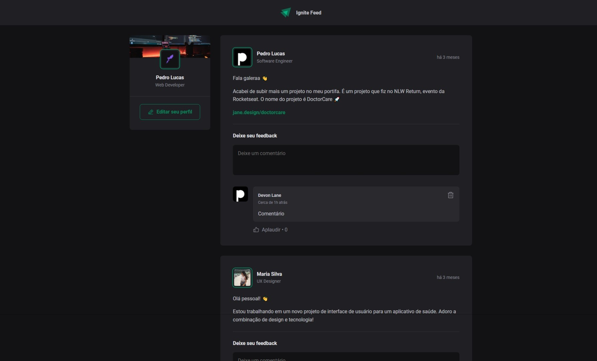

# Ignite Feed - Static Social Media Platform

## About The Project

Ignite Feed is a simulated social media blogging platform designed for educational purposes. It mimics the core functionalities of a blog where users can post content and engage with others through comments. As a static page, the interactions are not persistent, meaning any comments or likes will be reset upon page refresh. This project is ideal for understanding the basics of user interfaces and state management in React applications.

<div align="center">
   

_Screenshot of the Ignite Feed Interface_

[](https://github.com/pdro-lucas/ignite-reactjs/blob/feature/pizza-shop-web/ignite-feed-ts/public/preview/preview.mp4 'Preview')

_Video of the Ignite Feed Interface_

</div>

## Features

- **Static Posts**: Display posts from a predefined array mimicking a database.
- **Engagement**: Allows users to 'like' and comment on posts.
- **Interactivity**: Users can delete comments within the session.
- **Non-Persistent Data**: Interactions do not persist between page loads.

## Data Structure

The project uses a predefined data array with a specific structure for posts:

```javascript
const posts = [
  {
    id: 1,
    author: {
      name: 'Pedro Lucas',
      role: 'Software Engineer',
      avatarUrl: 'https://github.com/pdro-lucas.png',
    },
    content: [
      { type: 'paragraph', content: 'Fala galeraa 👋' },
      {
        type: 'paragraph',
        content: 'Acabei de subir mais um projeto no meu portifa...',
      },
      { type: 'link', content: 'jane.design/doctorcare' },
    ],
    publishedAt: new Date('2023-09-25 20:00:00'),
  },
  // More posts...
]
```

## Built With

This project is built with:

- [React](https://reactjs.org/) - A JavaScript library for building user interfaces.

## Getting Started

To get a local copy up and running follow these simple steps.

### Prerequisites

Make sure you have `npm` installed on your machine. If not, install it globally:

```sh
npm install npm@latest -g
```

### Installation

1. Clone the repository:

```sh
git clone https://github.com/pdro-lucas/ignite-reactjs.git
```

2. Navigate to the project directory:

```sh
cd ignite-reactjs/ignite-feed-ts
```

3. Install NPM packages:

```sh
npm install
```

## Usage

To start the application, run the following command:

```sh
npm run dev
```

Open [http://localhost:5173](http://localhost:5173) to view it in the browser.

## Contributing

Since this project is for educational purposes, contributions are not just welcome but encouraged as a learning exercise.

1. Fork the Project
2. Create your Feature Branch (`git checkout -b feature/AmazingFeature`)
3. Commit your Changes (`git commit -m 'Add some AmazingFeature'`)
4. Push to the Branch (`git push origin feature/AmazingFeature`)
5. Open a Pull Request

## License

Distributed under the MIT License. See `LICENSE` for more information.

## Contact

Pedro Lucas - [@pdrolucas](https://github.com/pdro-lucas) - pdrolucas.contato@gmail.com

Project Link: [https://github.com/pdro-lucas/ignite-reactjs](https://github.com/pdro-lucas/ignite-reactjs/ignite-feed-ts)
